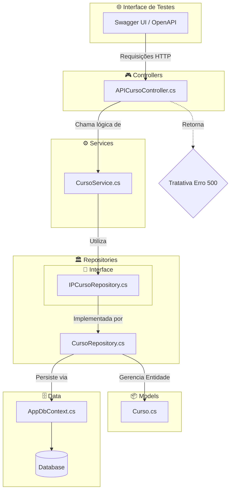
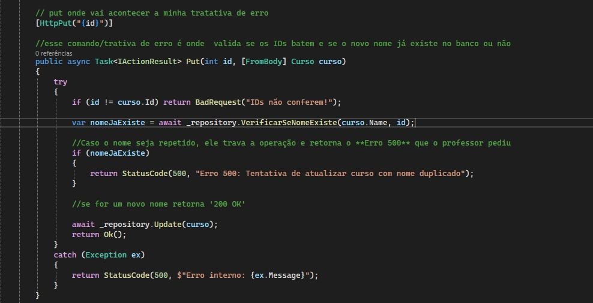
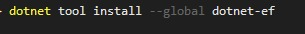
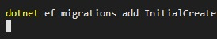
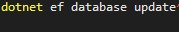

# Projeto De Criação API Gerenciamento De Cursos

Atividade feito no curso técnico de Desenvolvimento De Sistemas sobre criação de uma API com funcionalidade para gerenciamento de cursos e com funcionalidade de realizar uma tratativa de erros, visando a qualidade 
e robustez do tratamento de erros e corrigir as falhas que geram no erro 500. Utilizando blocos de tratamentos de exceções (try/catch).

---

A imagem ilustra a implementação solicitada pelo orientador no método Put, onde o sistema devereá realizar uma verificação preventiva no banco de dados antes de confirmar qualquer alteração. Através de um método que será visto logo abaixo no código. Em resumo, essa API tem como funcionalidade comparar o nome enviado com os registros já existentes, garantindo que nenhum outro curso (com ID diferente) possua o mesmo nome; caso a duplicidade seja confirmada, a execução é interrompida e retorna um Erro 500, servindo como uma barreira de segurança que impede a entrada de dados redundantes e garante a integridade da tabela.

---

## Arquitetura do Projeto

O projeto utiliza uma arquitetura em camadas para garantir que cada parte do código tenha uma responsabilidade única, sendo separados em Pastas e classes:

| Pastas 📂 | Classes ⚙️ |
| :--- | :--- |
| **Controllers:** Essa pasta funciona como a porta de entrada da API, sendo responsável por gerenciar as rotas e receber as requisições HTTP do usuário. | **APICursoController.cs** Onde ocorre a tratativa de erro sendo aplicada para validar os nomes e garantir que não haja duplicidade. |
| **Services:** Nessa pasta é onde centraliza as funções que não pertencem diretamente ao acesso a dados ou à interface.. | **CursoService:**  Sendo respons´vael por organizar o fluxo de informações. |
| **Repositories:** Sendo responsável por abstrair a complexidade do Entity Framework e pelas consultas no SQL. | **CursoRepository:** O método que verifica se um nome já existe antes de permitir a persistência dos dados. |
| **Interface:** Onde define quais métodos uma classe deve obrigatoriamente implementar. | **IPCursoRepository:** Garante que todos os serviços de persistência sigam o mesmo padrão de segurança. |
| **Models:** Permite atualizar ou corrigir lógicas na classe Visitor sem mexer na estrutura estável dos objetos. | **Curso:** Se os tipos de objetos mudam muito, o padrão gera um alto custo de atualização. |
| **Data:** Sendo responsável por espelhar as tabelas de dados em formato de código C#, servindo de base para todas as outras camadas. | **AppDbContext:** Onde define as propriedades e atributos da entidade, como nome e ID, que serão armazenados e manipulados pelo sistema. |

---

---
## Tratativa do Erro 500

Essa tratativa é capaz de validar a integridade dos dados antes mesmo que eles atinjam a camada de persistência. Ao realizar essa verificação da duplicidade que foi solicitada usando os métodos HttpPost e HttpPut, o software evita o processamento de nomes duplicados e evita falhas do banco de dados por respostas HTTP claras e amigáveis, garantindo que o catálogo de cursos permaneça único.

---
Foi solicitada que a tratativa ocorresse dentro da pasta controller, como mostrada na imagem acima que é uma breve parte do código da minha APICursoController.cs onde vai acontecer a verificação se o novo nome do curso que o usuário deseja atualizar através do PUT já está em uso por outro registro ou não. Caso o nome que o usuário digitar já esteja no meu bacno será detectada, a execução é interrompida com um Erro 500 e aprecendo para o usuário o porque desse erro e onde, como mostra na imagem abaixo:

---
## Pacotes usados e instalados para esse projeto

Para dar início ao projeto, logo após criar a API que foi feita no NET SDK 8.0, na linguagem C#, foi feita a instalação de dois pacotes, sendo eles:

- **Microsoft.EntityFrameworkCore.Sqlite (versão - 9.0.12):** Permite ao Entity Framework se comunicar com o SQLite, um banco de dados leve que dispensa configurações complexas de servidor.

- **Microsoft.EntityFrameworkCore.Tools (versão - 9.0.12):** Conjunto de ferramentas essenciais para executar comandos de Migrations dentro do Console do Gerenciador de Pacotes no Visual Studio.

---

## Conexão e comandos para o Banco De Dados

Para conectar um banco de dados minha API é de extrema importância que os dados persistem, onde as informações que forem criadas, listadas, atualizadas ou excluidas o CRUD sendo assim permite que essas informações não sejam perdidas quando o usuário fechar a aplicação. Os comandos utilizados foram todos em EntityFramework, sendo executados os seguintes comandos no terminal do Visual Studio.

---
#### 1º comando utilizado no terminal:

- Como não tinha as EntityFramework instaladas precisei utilizar esse comando abaico que foi o responsável por conseguir executar o dotnet-ef, sem essa instalação irá dar erro, pois o terminal irá reconhecer que esse pacote não está instalado e não conseguiria executar a pasta "migrations" e "database".

 

#### 2º comando utilizado no terminal:

- O comando abaixo atua como o arquiteto do banco de dados, realizando uma varredura completa no projeto para identificar classes que herdam de `DbContext`. Ao detectar a ausência de tabelas para as Models existentes, ele gera automaticamente a pasta Migrations contendo instruções em C# que detalham a criação de cada coluna e restrição.

 

#### 3º comando utilizado no terminal:

- O comando e o último é o passo final que materializa a infraestrutura, lendo a Connection String no appsettings.json e importando para o projeto para localizar ou criar o arquivo físico do banco de dados. Ele traduz os arquivos da pasta Migrations para a linguagem SQL, executando os scripts que estruturam as tabelas e colunas diretamente no disco, sendo assim o arquivo .db é gerado na raiz do projeto e estabelecendo a conexão real.

 
---
