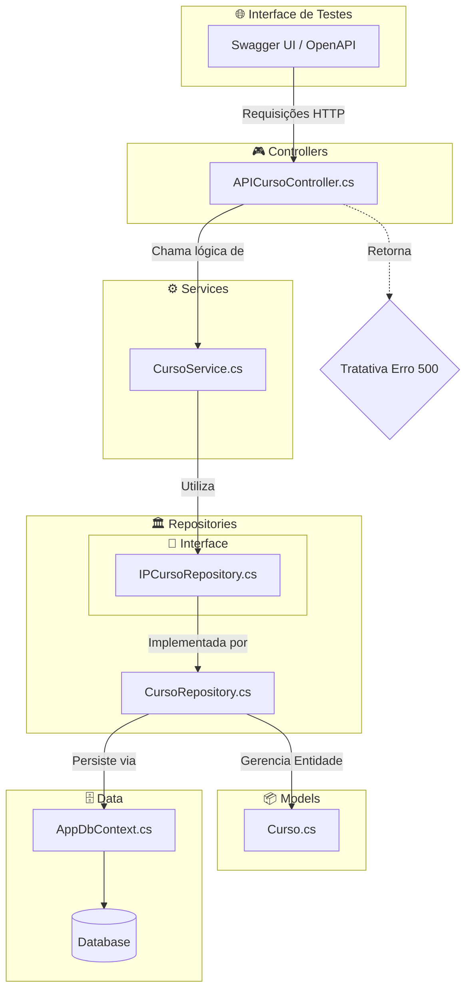

# Projeto De Criação API Gerenciamento De Cursos

Atividade feito no curso técnico de Desenvolvimento De Sistemas sobre criação de uma API com funcionalidade para gerenciamento de cursos e com funcionalidade de realizar uma tratativa de erros, visando a qualidade 
e robustez do tratamento de erros e corrigir as falhas que geram no erro 500. Utilizando blocos de tratamentos de exceções (try/catch).

---

A imagem ilustra a implementação solicitada pelo orientador no método Put, onde o sistema devereá realizar uma verificação preventiva no banco de dados antes de confirmar qualquer alteração. Através de um método que será visto logo abaixo no código. Em resumo, essa API tem como funcionalidade comparar o nome enviado com os registros já existentes, garantindo que nenhum outro curso (com ID diferente) possua o mesmo nome; caso a duplicidade seja confirmada, a execução é interrompida e retorna um Erro 500, servindo como uma barreira de segurança que impede a entrada de dados redundantes e garante a integridade da tabela.

---

## Arquitetura do Projeto

O projeto utiliza uma arquitetura em camadas para garantir que cada parte do código tenha uma responsabilidade única, sendo separados em Pastas e classes:

| Pastas 📂 | Classes ⚙️ |
| :--- | :--- |
| **Controllers:** Essa pasta funciona como a porta de entrada da API, sendo responsável por gerenciar as rotas e receber as requisições HTTP do usuário. | **APICursoController.cs** Onde ocorre a tratativa de erro sendo aplicada para validar os nomes e garantir que não haja duplicidade. |
| **Services:** Nessa pasta é onde centraliza as funções que não pertencem diretamente ao acesso a dados ou à interface.. | **CursoService:**  Sendo respons´vael por organizar o fluxo de informações. |
| **Repositories:** Sendo responsável por abstrair a complexidade do Entity Framework e pelas consultas no SQL. | **CursoRepository:** O método que verifica se um nome já existe antes de permitir a persistência dos dados. |
| **Interface:** Onde define quais métodos uma classe deve obrigatoriamente implementar. | **IPCursoRepository:** Garante que todos os serviços de persistência sigam o mesmo padrão de segurança. |
| **Models:** Permite atualizar ou corrigir lógicas na classe Visitor sem mexer na estrutura estável dos objetos. | **Curso:** Se os tipos de objetos mudam muito, o padrão gera um alto custo de atualização. |
| **Data:** Sendo responsável por espelhar as tabelas de dados em formato de código C#, servindo de base para todas as outras camadas. | **AppDbContext:** Onde define as propriedades e atributos da entidade, como nome e ID, que serão armazenados e manipulados pelo sistema. |

---

